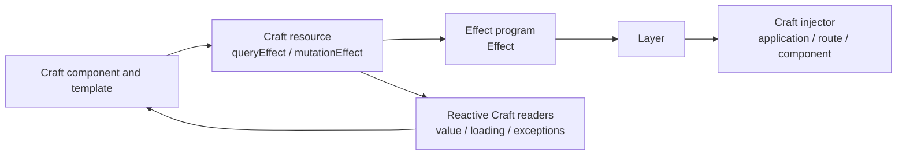

# Effect users: start here

This page is for teams that already use Effect and are evaluating CraftTS for
the frontend.

The important distinction is this:

> You do not need to replace your domain model or your Effect programs. You do
> need to adopt Craft's UI model for components, templates, reactive state,
> forms and routing.

Effect remains the place for domain programs, typed failures, services and
`Layer`s. Craft owns the browser-facing lifecycle: rendering, reactivity,
loading, cancellation and URL state.

## The boundary in one picture



The two sides have different responsibilities:

| Concern | Effect | CraftTS |
| --- | --- | --- |
| Domain rules | `Effect<A, E, R>` | consumes the result |
| Services | `Context.Service` + `Layer` | provides the Layer at a Craft scope |
| Business failures | tagged errors in `E` | typed exceptions to render or handle |
| UI state | not the owner | `state`, `queryParams`, derived readers |
| Loading and cancellation | Effect runtime | `queryEffect`, `mutationEffect`, `asyncProcessEffect` |
| Components and templates | not the owner | `craftComponent` and typed hyperscript |

`yield*` appears on both sides, but it does not mean the same thing. Inside an
Effect program it reads an Effect service or runs another Effect. Inside a Craft
factory it declares a Craft dependency or crosses the boundary through an
Effect adapter.

## A 15-minute quickstart

The goal is one page that loads a user from an Effect program and renders the
result through a Craft query.

### 1. Install the matching packages — 2 minutes

```shell
npm i @craft-ts/core@beta @craft-ts/component@beta @craft-ts/effect@beta
npm i effect@rc
npm i -D @craft-ts/dev-tools@beta
```

Keep the Craft packages on the same version. See the
[compatibility and maturity matrix](/resources/effect-compatibility) before
using this in a production application.

### 2. Define the domain program — 4 minutes

This code is ordinary Effect code. It does not import Craft.

<<< @/tests/snippets/learn-effect/quickstart.spec.ts#domain

The component will call `loadUser`, but it will not resolve
`UserRepositoryService`. The nearest `Layer` will provide it.

### 3. Cross the boundary with `queryEffect` — 4 minutes

The adapter turns `Effect<User, UserNotFound, UserRepositoryService>` into a
Craft resource with loading, value and exception readers.

<<< @/tests/snippets/learn-effect/quickstart.spec.ts#component

Do not call `Effect.runPromise` or subscribe inside the component. The resource
owns execution, cancellation and the transition between loading, success and
failure.

### 4. Provide the Layer and install the bridge — 3 minutes

Install the bridge once at application bootstrap. Provide the Effect Layer at
the same Craft scope where the operation is used.

<<< @/tests/snippets/learn-effect/quickstart.spec.ts#bootstrap

Run the application with your normal frontend command. The executable version
of this example is also covered by the docs test suite.

### 5. Verify the boundary — 2 minutes

```shell
npx nx test docs
npx nx typecheck demo-effect
npx nx test demo-effect
```

The docs test target now performs three checks: it transpiles every TypeScript
or TSX code fence in `learn-effect`, type-checks the complete snippets under
`tests/snippets/learn-effect`, and executes their Vitest tests. The transpilation
check is intentionally syntax-focused because several excerpts are meant to be
copied into an existing Craft or Effect generator; complete examples receive
the stronger typecheck and runtime coverage. The Effect demo covers success,
typed business errors, defects, application Layers and route-scoped Layers.

For a runnable starter that keeps this boundary intentionally small, use the
repository's [`quickstart-effect`](https://github.com/craft-ts/craft-ts/tree/main/apps/quickstart-effect)
application. It is wired into the same ESLint, EffectTS diagnostics and
architecture checks that a new Effect frontend should adopt.

## Which adapter should I choose?

| Situation | Adapter |
| --- | --- |
| Local toggle, draft or selection | `state` |
| Server or domain read | `queryEffect` |
| Explicit write | `mutationEffect` |
| Reactive Effect derived from Craft state | `computedEffect` |
| Export, refresh or other explicit command | `asyncProcessEffect` |
| One Effect in a guard or resolver | `runEffect` |
| URL filters and pagination state | native Craft `queryParams` |

There is intentionally no `stateEffect`: local UI state belongs to Craft; an
Effect is introduced when a computation, I/O operation or service dependency
crosses into the UI.

## Continue from here

- Read the [full Effect learning path](/learn-effect/).
- Check [compatibility and maturity](/resources/effect-compatibility).
- Follow the [progressive adoption plan](/resources/effect-adoption).
- For the detailed API contract, read [Using Effect with CraftTS](/guide/advanced/effect).
