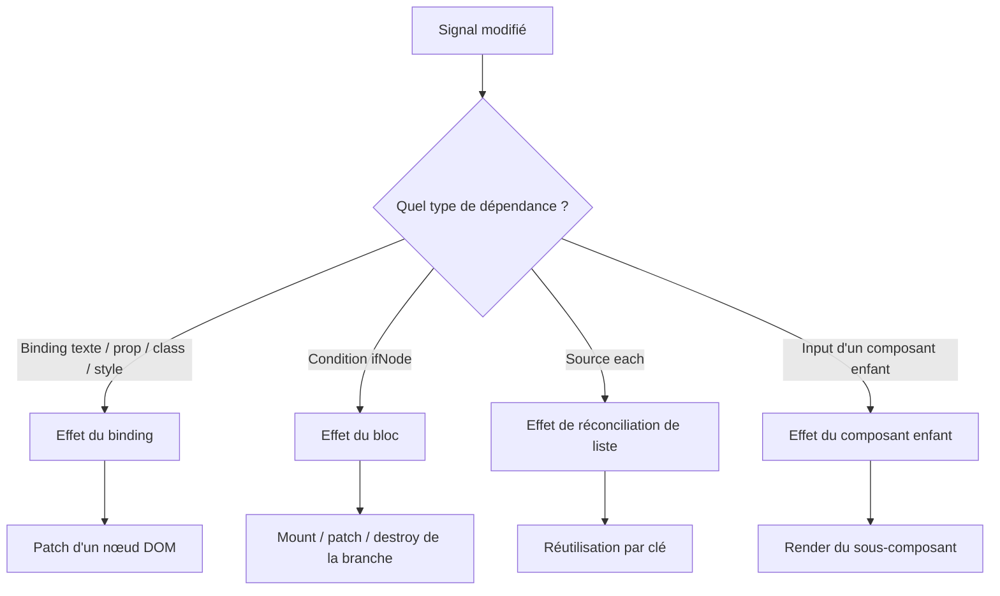

# Rendu réactif granulaire des composants Craft

## Objectif

Faire évoluer le renderer Craft d’un modèle :

```text
signal modifié
  → rerender du composant
  → reconstruction de l’arbre VNode
  → diff de l’arbre
  → patch DOM
```

vers un modèle séparant :

```text
changement structurel
  → effet structurel du composant ou du bloc

changement d’un binding
  → effet du binding concerné
  → patch de son nœud DOM
```

Le but est qu’un signal utilisé uniquement par un binding texte, une classe,
un attribut ou un style ne provoque pas la réévaluation des autres bindings du
même composant.

## Contexte actuel

Le renderer décrit actuellement le comportement suivant :

- `ComponentRenderedNode` possède un `craftEffect('component-render', ...)` ;
- le template du composant est réexécuté lorsqu’un signal lu pendant le rendu
  change ;
- `patchRenderedChildren` parcourt les enfants existants et les nouveaux VNodes ;
- `normalizeChildren` évalue immédiatement les fonctions utilisées comme
  bindings texte ;
- `ElementRenderedNode.patchProperties` réévalue les props fonctionnelles,
  notamment les attributs, classes et styles ;
- les composants enfants possèdent déjà leur propre effet de rendu et
  constituent donc une première frontière de granularité.

Références principales :

- `libs/component/src/lib/render/interpreter.ts` ;
- `libs/component/src/lib/render/vnode.ts` ;
- `libs/component/src/lib/hyperscript.ts` ;
- `libs/component/src/lib/render/interpreter.spec.ts`.

## Invariants à préserver

1. Le DOM existant est réutilisé lorsque l’identité du nœud ne change pas.
2. Les composants enfants ne sont pas recréés lorsqu’une valeur d’input change.
3. Les blocs `ifNode` et `forNode` conservent leur sémantique actuelle,
   notamment la réutilisation des éléments suivis par clé.
4. Les callbacks de rendu restent synchrones et déterministes.
5. Les effets sont détruits avec le nœud DOM, le bloc ou le composant qui les
   possède.
6. Un rendu ne modifie pas les signaux qu’il lit.
7. Plusieurs écritures sur un même signal avant le flush sont coalescées en un
   seul rendu observable.
8. Une mise à jour locale ne doit pas modifier l’ordre, l’identité ou le
   contenu des nœuds non concernés.

## Hors périmètre initial

- changer l’API publique générale des composants ;
- remplacer le renderer par Ivy ;
- introduire une dépendance à une API privée Angular ;
- optimiser simultanément la virtualisation des listes ;
- garantir la granularité pour une valeur déjà calculée avant la création du
  VNode.

## Architecture cible



Le renderer doit distinguer deux familles de valeurs :

- les valeurs structurelles, qui déterminent quels VNodes existent ;
- les valeurs de binding, qui déterminent uniquement la valeur d’un nœud déjà
  monté.

## Plan d’implémentation

### Phase 0 — Établir une baseline mesurable

Avant de modifier le runtime :

- ajouter un compteur de rendu par composant et par binding en mode test ;
- mesurer le nombre d’appels de template, de callbacks de binding et de
  patches DOM ;
- ajouter un scénario minimal avec deux signaux et deux bindings indépendants ;
- enregistrer les résultats du renderer actuel ;
- vérifier que les tests du package peuvent compiler et s’exécuter dans l’état
  courant du dépôt.

Scénario de référence :

```ts
const first = signal('A');
const second = signal('B');

div([
  p(() => first()),
  p(() => second()),
]);
```

Après `first.set(...)`, le comportement cible est :

- le binding de `first` est exécuté une fois ;
- le binding de `second` n’est pas exécuté ;
- le second élément `<p>` est conservé ;
- aucun patch DOM n’est effectué sur le second élément.

### Phase 1 — Introduire une représentation explicite des bindings

Ne plus convertir immédiatement une fonction de binding en `TextNode` dans
`normalizeChildren`.

Introduire une représentation interne, par exemple :

```ts
interface ReactiveTextNode {
  readonly kind: 'reactive-text';
  readonly binding: CraftTextBinding;
}
```

Le type public `CraftNodeChild` peut continuer à accepter une fonction. La
conversion vers `ReactiveTextNode` doit avoir lieu dans le renderer, afin de
conserver la fonction et donc son identité de binding.

Pour les props, conserver séparément :

- la valeur statique ;
- le callback de binding ;
- la dernière valeur résolue ;
- l’effet responsable de la mise à jour ;
- la fonction de destruction.

Ne pas traiter les callbacks d’événements comme des bindings de rendu. Ils ne
doivent être exécutés qu’en réponse à un événement.

### Phase 2 — Créer les effets de binding

Ajouter des rendered nodes spécialisés :

- `ReactiveTextRenderedNode` ;
- `ReactiveAttributeBinding` ;
- `ReactiveClassBinding` ;
- `ReactiveStyleBinding` ;
- éventuellement `ReactivePropertyBinding` pour `value`, `checked`,
  `disabled`, etc.

Chaque binding doit :

1. être créé dans un contexte `untracked` ;
2. évaluer son callback dans son propre `craftEffect` ;
3. comparer la nouvelle valeur avec la précédente ;
4. ne modifier le DOM qu’en cas de changement ;
5. enregistrer son nettoyage dans le rendered node propriétaire ;
6. être détruit avant que le nœud DOM propriétaire ne soit supprimé.

Le patch structurel ne doit pas collecter par inadvertance les dépendances
des bindings enfants. Les créations et les mises à jour de rendered nodes
doivent donc être soigneusement séparées de l’évaluation des callbacks.

### Phase 3 — Isoler les dépendances structurelles

Déplacer progressivement les dépendances structurelles dans des effets
dédiés :

- `IfRenderedNode` : effet sur la condition et patch de la branche active ;
- `ForRenderedNode` : effet sur la source de collection et réconciliation par
  clé ;
- `DeferRenderedNode` : conserver les transitions placeholder/loading/loaded ;
- `ProjectionRenderedNode` et `TemplateRenderedNode` : conserver leurs
  contextes de déclaration et isoler leurs mises à jour ;
- `ComponentRenderedNode` : effet structurel limité aux inputs structurels,
  props hôtes et création des enfants.

Les bindings présents à l’intérieur d’une branche doivent être possédés par la
branche, et non par l’effet du composant parent.

### Phase 4 — Stabiliser les frontières de composants

Vérifier les cas suivants :

- un signal lu uniquement dans l’enfant ne rerend pas le parent ;
- un input réactif lu par l’enfant reste suivi par l’effet de l’enfant ;
- un input structurel modifié entraîne bien le patch attendu ;
- le composant enfant n’est pas recréé si seul son binding change ;
- la destruction du parent détruit tous les effets descendants.

Les props objets et fonctions devront conserver une identité stable lorsque la
structure ne change pas. Si le template recrée systématiquement un callback,
le renderer devra remplacer proprement l’ancien binding sans empiler des effets.

### Phase 5 — Clarifier la syntaxe réactive

La forme recommandée pour un binding doit être explicite :

```ts
p(() => `Count: ${count()}`);
button({ disabled: () => isDisabled() });
div({ class: () => ({ active: isActive() }) });
```

Une valeur déjà calculée n’est pas récupérable par le renderer :

```ts
p(`Count: ${count()}`);
```

Dans ce cas, `count()` est lu pendant la construction du VNode et le renderer
ne connaît plus l’emplacement précis auquel rattacher la dépendance.

Une évolution ultérieure pourrait introduire une transformation compilée des
templates, mais elle ne doit pas être nécessaire pour la première version du
runtime granulaire.

### Phase 6 — Prévenir les boucles de propagation

Les callbacks de rendu doivent être purs :

- ils peuvent lire des signaux ;
- ils peuvent calculer une valeur ;
- ils ne doivent pas appeler `set`, `update`, `mutate` ou déclencher une
  mutation observable.

Les écritures doivent être réalisées dans :

- les callbacks DOM ;
- les outputs ;
- les mutations ;
- les effets métier explicitement déclarés.

Ajouter progressivement :

1. une documentation de cette règle ;
2. une règle ESLint pour les patterns détectables ;
3. une erreur de développement lorsqu’un mécanisme Craft contrôlé détecte une
   écriture pendant un rendu ;
4. un test de régression avec une mise à jour bornée ;
5. une télémétrie de diagnostic indiquant le composant et le binding en cas de
   cycles répétés.

Une limite arbitraire de nombre de rendus ne doit pas être le mécanisme normal
de correction. Elle peut exister comme coupe-circuit de développement, mais la
garantie principale doit venir de la séparation lecture/rendu et de la pureté
des callbacks.

## Tests à ajouter

### Tests de propagation

- un signal lu par un seul binding n’exécute que ce binding après modification ;
- un signal non lu par le template ne provoque aucun rerender ;
- deux écritures avant le flush provoquent un seul passage observable ;
- deux signaux modifiés avant le flush ne recréent pas l’arbre structurel deux
  fois ;
- le DOM conserve l’identité des nœuds non concernés.

### Tests de composants enfants

- un signal local de l’enfant ne rerend pas le parent ;
- un signal lu dans le parent mais affiché dans l’enfant suit la frontière
  attendue ;
- un enfant memoïsé par identité d’input n’est pas recréé ;
- les effets de l’enfant sont détruits lorsque l’enfant sort d’un `ifNode` ou
  d’un `forNode`.

### Tests de blocs

- `ifNode` ne réévalue pas la branche inactive pour un changement de binding
  local ;
- `forNode` ne réévalue pas les items dont la clé et les bindings restent
  inchangés ;
- une modification d’un item ne recrée pas les autres items ;
- ajout, suppression, déplacement et doublon de clé conservent les garanties
  existantes.

### Tests de cycle

- un callback de rendu pur reste stable sur de nombreuses mises à jour ;
- une écriture contrôlée depuis un callback de rendu est signalée en mode
  développement ;
- la destruction d’un composant arrête toute propagation ultérieure ;
- un effet détruit ne réagit plus à son ancien signal.

## Benchmarks

Créer une suite dédiée avec trois implémentations équivalentes :

- Angular natif ;
- Craft avec le renderer actuel ;
- Craft avec le renderer granulaire.

### Initialisation

Mesurer en build production :

- taille des bundles ;
- téléchargement ;
- parsing et exécution JavaScript ;
- bootstrap ;
- premier rendu utile ;
- première interaction possible.

### Grande liste

Tester 100, 1 000 et 10 000 lignes avec :

- modification d’une ligne visible ;
- modification d’une ligne non visible ;
- modification de 1 % des lignes ;
- modification de toute la liste ;
- ajout, suppression, filtrage et tri.

### Scroll

Mesurer séparément :

- scroll sans état réactif ;
- scroll mettant à jour une plage visible ;
- scroll avec virtualisation ;
- mises à jour de données pendant le scroll.

Métriques :

- délai modification → frame affichée ;
- médiane et p95 du temps de rendu ;
- tâches principales supérieures à 50 ms ;
- frames perdues ;
- mémoire ;
- nombre de templates et de bindings exécutés.

Les scénarios doivent être déterministes, exécutés dans le même navigateur,
avec les mêmes données et sans logs applicatifs. Les résultats doivent être
exportés en JSON afin de suivre les régressions dans le temps.

## Critères d’acceptation

Le travail sera considéré comme réussi lorsque :

1. un changement de binding local n’exécute pas les bindings frères ;
2. un changement local ne rerend pas le parent ou les composants voisins ;
3. les tests de cycle et de destruction sont présents ;
4. les listes réutilisent leurs nœuds par clé ;
5. aucun effet n’est laissé actif après destruction ;
6. la syntaxe de binding explicite est documentée ;
7. le benchmark montre une croissance du coût principalement liée au nombre
   de bindings réellement modifiés, et non au nombre total de bindings ;
8. le renderer actuel reste disponible comme comportement de compatibilité
   pendant la migration si un cas avancé n’est pas encore isolé.

## Ordre recommandé des livraisons

1. baseline et compteurs de test ;
2. rendered node de texte réactif ;
3. bindings d’attribut, propriété, classe et style ;
4. isolation des effets `ifNode` et `forNode` ;
5. frontières composants/projection/template ;
6. diagnostics de pureté et règle ESLint ;
7. benchmarks automatisés et seuils de régression ;
8. documentation publique et migration des exemples.
