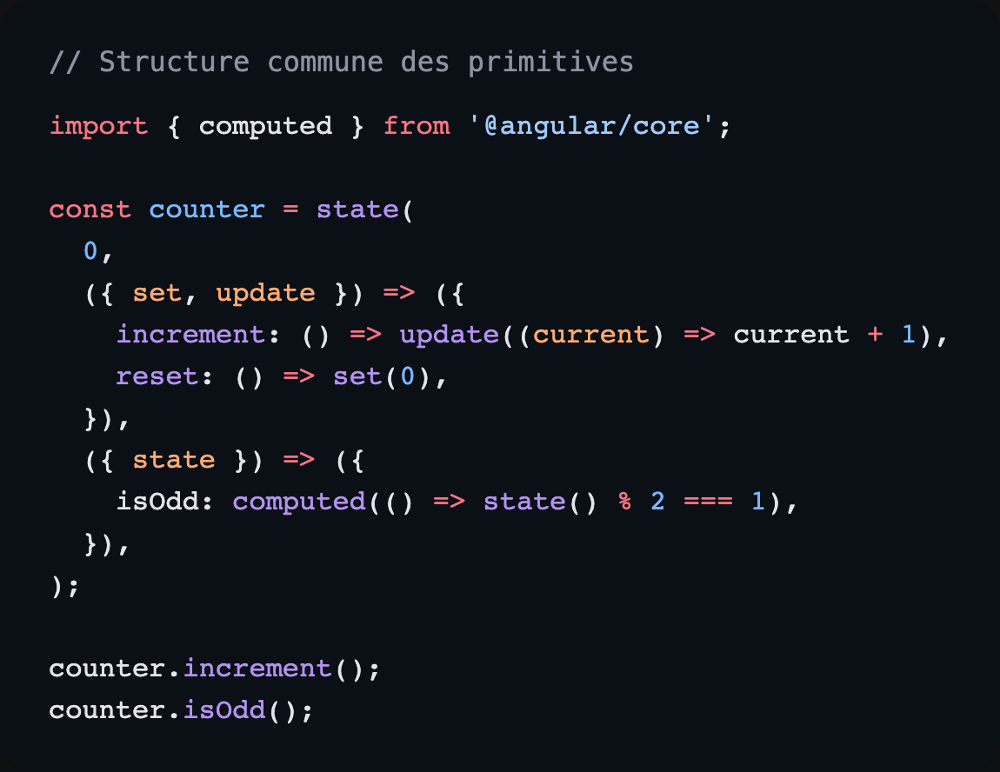
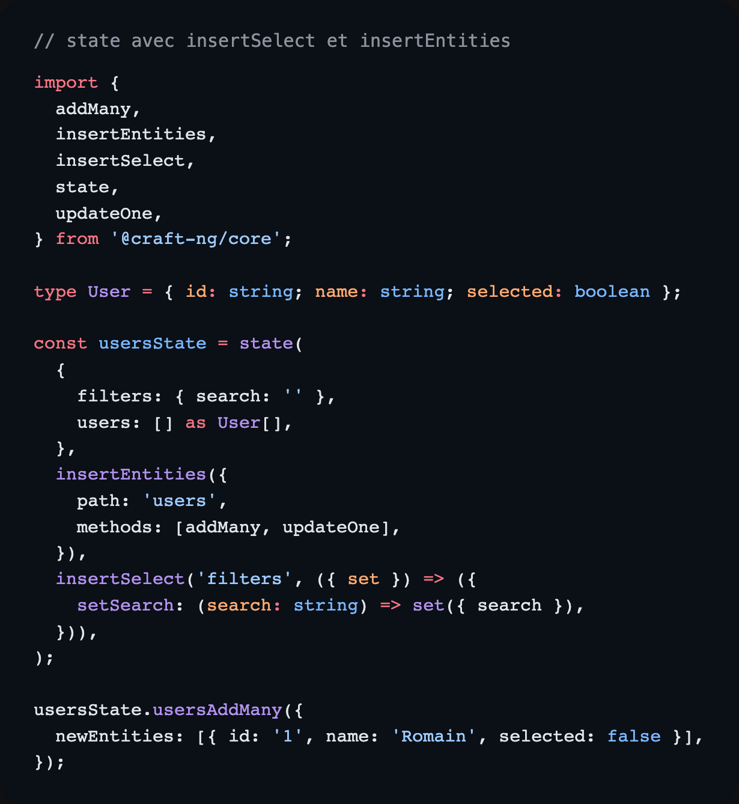
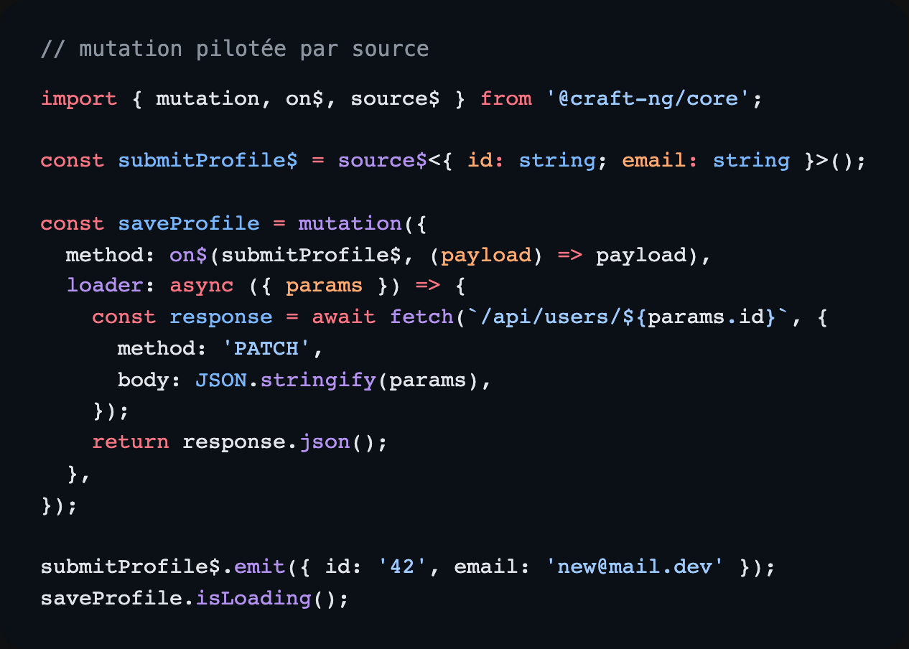
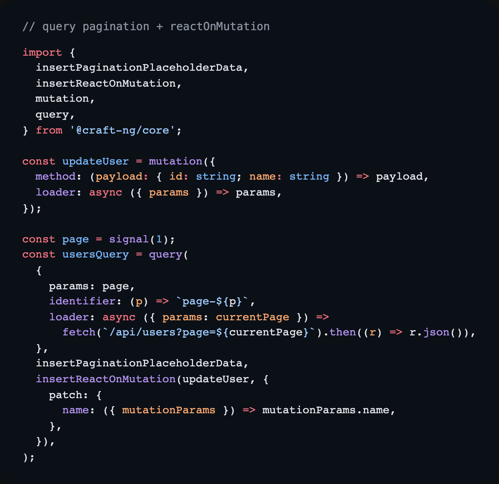
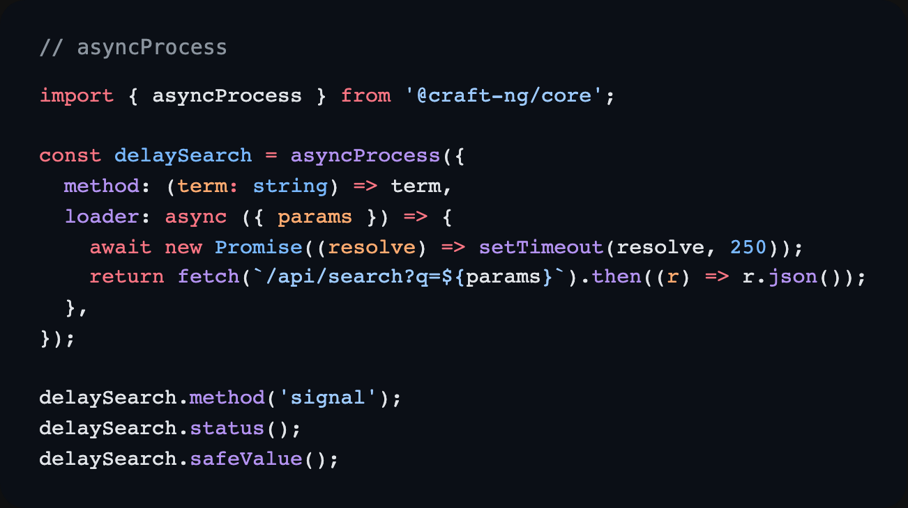
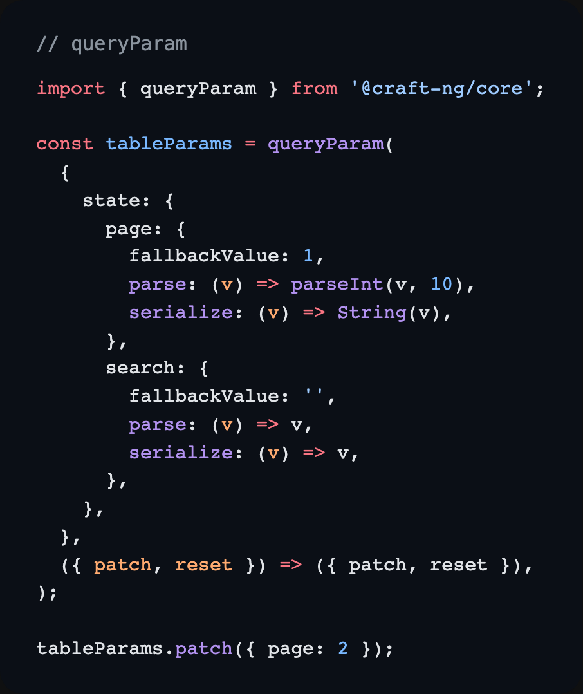
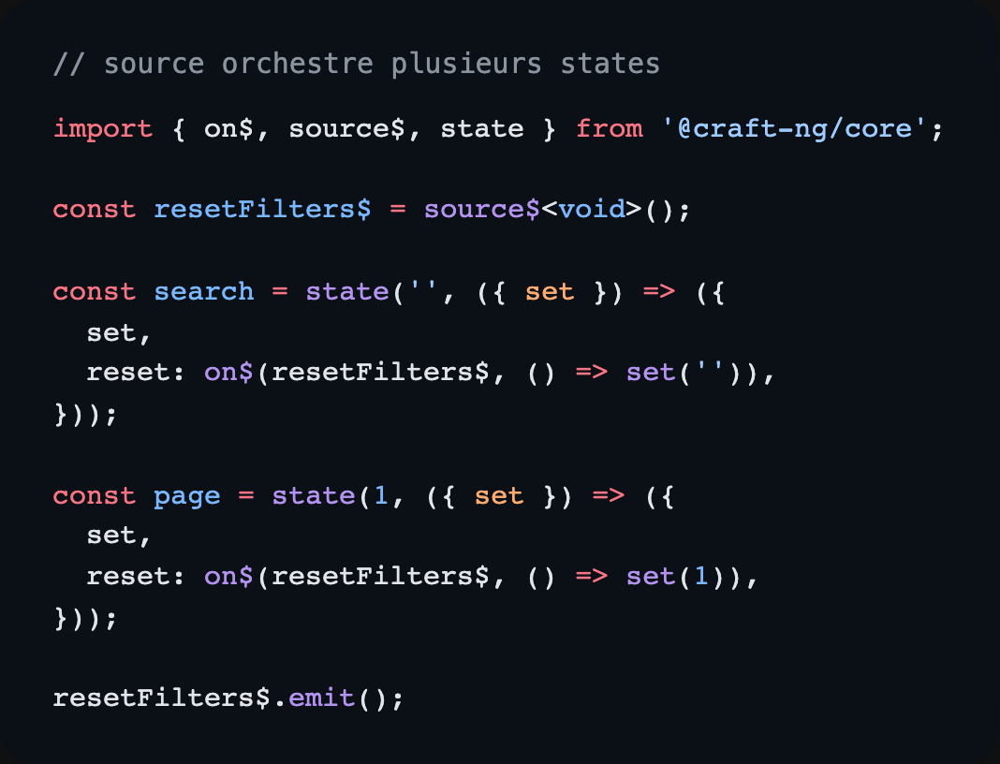
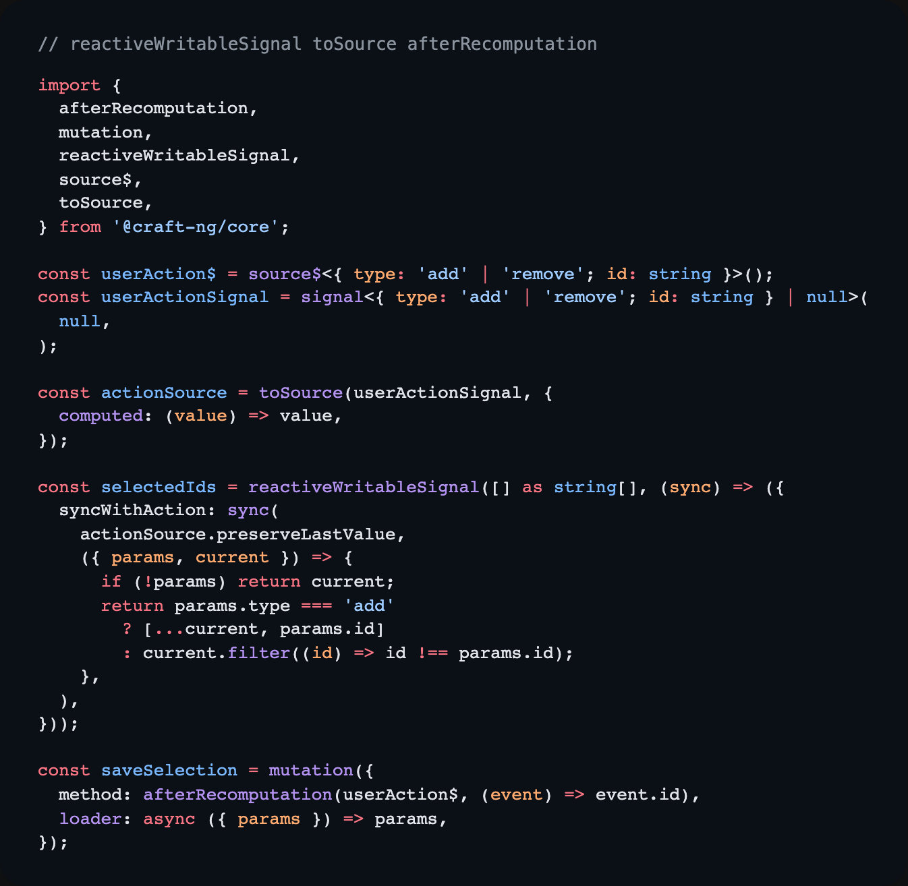
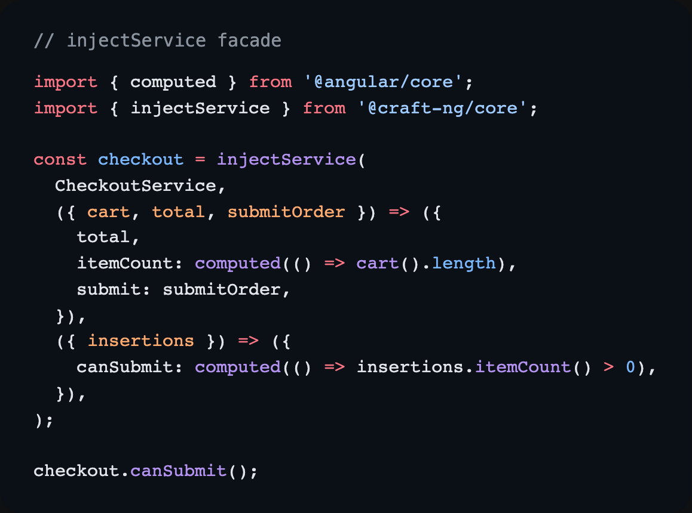

Quand je construis une feature Angular un peu serieuse, je veux toujours la meme chose:

- un seule source de vérité
- un flux de donnees clair
- un code composable
- une DX solide
- et surtout une type-safety qui m'evite de jouer aux devinettes

C'est exactement l'objectif de @craft-ng.

Une lib complete pour gerer tous les types d'etat d'une application:

- **client state**: etats locaux, listes, UI, selection...
- **server state**: chargement, cache, mutation, pagination, optimistic update...
- **URL state**: query params synchronises, type-safe, avec fallback

Pour i states les plus complexes, des insertions pretes a l'emploi pour se rendre la vie plus facile.

Qu'ils soient simples ou complexes, le principe reste toujours le meme.

L'idee n'est pas de reinventer un store monolithique de plus.
L'idee, c'est que la logique est portee par des **primitives declaratives et reactives**, que tu peux assembler, enrichir et composer sans casser ce qui existe.

Ces primitives peuvent etre utilisees:

1. **directement dans les composants** — elles se lient automatiquement aux cycles de vie Angular. De mon point de vue, le composant n'est pas la pour gerer la logique, mais pour aider a l'orchestrer.
2. **dans des services Angular** — pour profiter des mecanismes d'injection et de partage qu'on connait deja.
3. **dans un store craft** — pour aller plus loin et gerer l'orchestration a un niveau superieur, tout en beneficiant des memes principes de composition.

Dans cet article, je vais:

- presenter la structure commune des primitives
- montrer comment exposer méthodes et etat derives via les insertions
- donner un exemple concret pour chaque primitive
- faire un tour rapide des insertions utiles
- expliquer pourquoi source$ change vraiment la facon de structurer le state
- terminer avec injectService et le store craft

> ⚠️ **@craft-ng est une librairie experimentale.** Je ne recommande pas de l'utiliser en production pour le moment. Cet article est avant tout un partage des concepts.

## 1) Une structure commune a toutes les primitives

Que tu utilises state, query, mutation, asyncProcess ou queryParam, la logique de composition reste la meme:

1. une configuration de base
2. des insertions pour exposer des méthodes / des etats derives



Ce point est cle: tu n'apprends pas 5 APIs differentes, tu apprends un modele mental unique.

// todo on récupère les insertions précédentes ?

## 2) Les primitives: fonctionnement + exemples concrets

Dans la pratique, chaque primtive apporte ses fonctionnalités qui lui sont propres, et le composant/service/store m'aide à les orchestrer.

### state

state gere le client state synchrone.
C'est la base pour modeler un etat local, l'etendre, puis le specialiser.

Avec insertSelect (disponible dans la prochaine version) et insertEntities, on garde une responsabilite claire par zone d'etat, meme avec des objets imbriqués.



Ce que j'aime ici:

- l'etat reste granulaire
- les méthodes suivent la structure du state
- la lecture du code reste directe

### mutation

mutation sert a modifier (UPDATE/PUT/PATCH/DELETE) des données cote serveur.
Tu peux la piloter par méthode directe ou par source$.

Version méthode directe avec `.mutate(...)`:

```ts
const updateUser = mutation({
  method: (payload: { id: string; name: string }) => payload,
  loader: async ({ params }) => {
    const response = await fetch(`/api/users/${params.id}`, {
      method: 'PATCH',
      body: JSON.stringify(params),
    });
    return response.json();
  },
});

updateUser.mutate({ id: '42', name: 'Romain' });
```

La version source$ est tres pratique quand tu veux un flux event-driven.



> On peut aussi les appeler en parallele, avec des identifiers, pour gerer des cas plus complexes (ex: plusieurs mutations de suppression dans une liste).

### query

query gere le server state (chargement, valeur, erreur, cache) et peut tourner en parallele via identifier (ex: pour faire de la pagination).

Avec insertPaginationPlaceholderData + insertReactOnMutation, on obtient:

- une pagination fluide
- des updates reactifs liés aux mutations (optimistic update/patch, auto reload).
- moins de code imperatif



### asyncProcess

asyncProcess est ideal pour des traitements async qui ne sont pas strictement des queries/metiers CRUD (debounce, wrappers API natives, orchestration).



### queryParam

queryParam synchronise l'etat avec l'URL, tout en restant type-safe (parse/serialize/fallback).



## Exemples de la doc qui m'ont inspire

Si tu veux voir des versions plus completes des patterns presentes ici, je te conseille particulierement:

- les exemples primitives (query, mutation, full demo): https://ng-angular-stack.github.io/craft/examples
- l'approche list-with-pagination pour visualiser insertPaginationPlaceholderData en contexte
- les exemples Pixel Art / Pixel Art Matrix pour voir insertSelect sur des structures plus profondes
- la section exceptions pour les cas metier avec erreurs type-safe, pour ne pas perdre d'information et offrir la meilleur UX/UI à tes utilisateurs

Ces exemples m'ont servi de base pour structurer les snippets de cet article.

## 3) Exposer méthodes et etat derive avec les insertions

Tu peux partir simple, puis enrichir sans casser le contrat initial.

### Creer de la logique reutilisable est tres simple

Tu peux extraire une insertion dans une fonction custom et la rebrancher partout:

```ts
const counter = state(0, (context) => myCustomFn(context));
```

Implementation simple (dans cet esprit):

```ts
const myCustomFn = ({
  update,
  set,
  state,
}: {
  update: (updater: (v: number) => number) => void;
  set: (value: number) => void;
  state: Signal<number>;
}) => ({
  increment: () => update((current) => current + 1),
  decrement: () => update((current) => current - 1),
  reset: () => set(0),
  isOdd: computed(() => state() % 2 === 1),
});

const myState = state(0, (context) => myCustomFn(context));

myState.increment();
myState.isOdd();
```

Pour les cas plus pousses, j'etudie differents patterns pour que ca reste aussi simple que possible cote API et usage.

## 4) Tour rapide de quelques insertions utiles

### insertPaginationPlaceholderData (query)

Pour garder les donnees de la page precedente pendant le chargement de la suivante.
Resultat: UX plus fluide, moins de flicker.

### insertReactOnMutation (query)

Pour synchroniser automatiquement le cache query avec le resultat d'une mutation (patch/optimistic/reload selon le besoin).

### insertLocalStoragePersister (state/query/mutation/asyncProcess)

Pour persister et rehydrater automatiquement avec localStorage.
Tres utile pour garder l'etat entre sessions.

### insertEntities

Pour manipuler des collections avec des utilitaires prets a l'emploi (add, set, update, remove, upsert...), en restant type-safe.

### insertSelect

Pour cibler un sous-arbre d'etat et exposer des méthodes/derives au bon endroit.
Hyper utile sur des structures imbriquées. (Prochainement disponible)

## 5) Pourquoi source$ est un vrai levier d'architecture

source$ est l'outil que j'utilise pour garder des states granulaires sans perdre la simplicite d'orchestration.

Cela correspond grosso-modo à un subject dans RxJS.

### Cas 1: plusieurs states reagissent au meme evenement

Au lieu d'un gros state qui gere tout, plusieurs states petits et lisibles peuvent reagir au meme trigger.



Ca donne:

- responsabilites claires
- meilleure DX
- flux de mise a jour plus facile a raisonner

Et surtout: tu peux commencer avec une méthode exposée, puis migrer vers une réaction on$ sans rearchitecture lourde.

### Cas 2: state imbriqué + insertSelect

Dans des structures profondes, insertSelect permet d'exposer le bon niveau d'API.
Tu peux aussi exposer une source$ plus haut, puis reagir dans plusieurs zones nested sans destructurer 5 couches partout.

### Cas 3: event-driven (et pont avec Observable)

source$ + on$ permettent de reagir a des evenements, y compris depuis un Observable.
Pour ceux qui aiment l'event-driven, c'est tres naturel.

Et si tu veux rester dans un style state-driven et réagir à des changements d'état, il y a aussi:

- reactiveWritableSignal
- afterRecomputation
- toSource



## 6) La philosophie continue avec injectService

injectService permet de construire une facade typee au-dessus d'un service Angular trop large.
Tu exposes uniquement ce qui est utile au cas d'usage, tu derives proprement, et tu gardes la maitrise de l'API publique.



## 7) Et au-dessus: le store `craft`

La lib expose aussi un store `craft`, toujours basé sur la composition, la type-safety et le découplage.
Tu peux composer states, queries, mutations, sources, inputs et query params dans une architecture cohérente, sans perdre le contrôle fin.

Plus de détails dans un prochain article, sinon il y a la doc ;D

## Conclusion

Si je devais résumer @craft-ng en une phrase:
composer des briques simples pour gérer des logiques complexes, sans quitter un modèle déclaratif/reactif/type-safe.

Et la lib ne s'arrête pas là.
A l'heure où j'écris cet article, d'autres utilitaires arrivent dans la même philosophie.

Le prochain utilitaire, si je devais n'en partager qu'un :

- un wrapper autour des signal forms, avec gestion type-safe des erreurs et de la logique complexe interdépendante.

N'hésite pas à aller voir la doc ou à mettre une étoile sur le repo si tu veux suivre l'évolution de la lib, ou à me faire un retour si tu as des idées d'amélioration !

---

Je suis Romain Geffrault.
Développeur Angular et créateur de @craft-ng
Suis-moi pour plus de contenu sur Angular

Docs: https://ng-angular-stack.github.io/craft/
