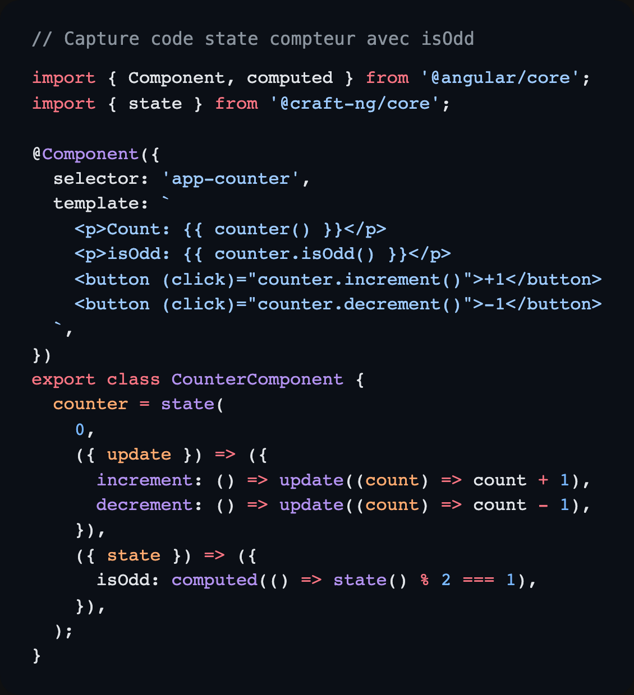

State dans un composant Angular : simple, lisible, efficace

Tu veux un exemple minimal pour intégrer `state` de @craft-ng dans un composant ?

Ici, on a un compteur avec :

- `increment()`
- `decrement()`
- un `computed` `isOdd`

Résultat 👇

- un état local clair
- des actions explicites
- une vue qui reste ultra facile à lire

Ce que j’aime dans cette approche :

- le code est déclaratif
- tu peux enrichir progressivement sans complexifier la base
- Pour la suite ? Les insertions pour un state state 100% composable.

Doc @craft-ng : https://ng-angular-stack.github.io/craft/

Ps: Je suis sur le point de finir un insertion très stratégique pour le pilotage de logique sur des states complexes à plusieurs niveaux. Hâte de vous montrer ça !

Je suis Romain Geffrault.
Développeur Angular et créateur de @craft-ng
Suis-moi pour plus de contenu sur Angular
